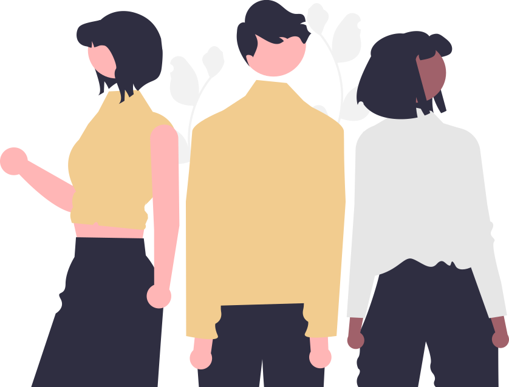

# Final Project 

## Introduction
We've come to the final week of our Kibo School journey and we must say, it has been quite a blast! From the simple to understand and information-packed lessons down to the step-by-step fun practices and projects, everything has been wonderful and enlightening. 
Therefore, it is with great excitement that we plan and design our final project to showcase our skills so far. 

## Project Title
 The title of our project is DooDles

 ## How it works
 The illustrations are displayed in a section and the contents are held in divs. When hovered over any, they would pop up and pop down when the mouse leaves.

  <section class="doodle-art-main" id="gallery">
    
      

         
         
        
Book Lover

      

      

         
         
        
Buddies

      

      

         
         
        
People

      

      

         
          
        
Office Snack

      

      
  </section>

## The Code That Makes It Happen
  The JavaScript creates a hover effect, that makes the div come up when hovered and gives it a box-shadow.

    for (let div of gallery){
    div.addEventListener('mouseover', () =>{
          console.log('over here')
          div.classList.add('transform')
          div.classList.add('shadow')  
    })
    }

    for (let div of gallery){
    div.addEventListener('mouseout', () =>{
          div.classList.remove('transform')
          div.classList.remove('shadow')
    })
    }